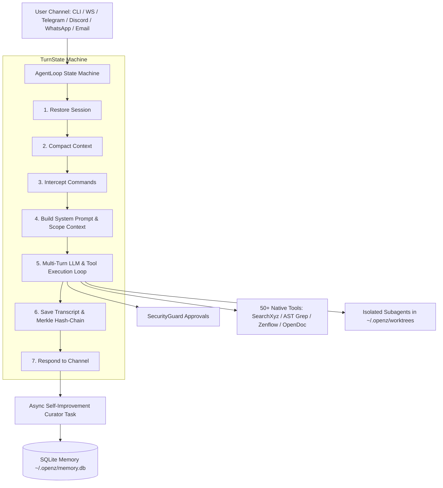

<p align="center">
  
</p>

<h1 align="center">OpenZ 🦊</h1>

<p align="center">
  <strong>High-Performance, Local-First Async Personal AI Agent Framework in Rust</strong>
</p>

<p align="center">
  <a href="https://github.com/aswin402/openz-rs"></a>
  <a href="https://www.rust-lang.org/"></a>
  <a href="https://tokio.rs/"></a>
  <a href="https://github.com/aswin402/openz-rs/blob/main/LICENSE"></a>
  <a href="https://github.com/aswin402/openz-rs"></a>
</p>

---

OpenZ is a local-first AI agent runtime built in Rust. It combines an interactive terminal agent (TUI), 50+ native tools, durable SQLite cognitive memory, browser-backed research, document/media automation pipelines, multi-channel communication (CLI, WebUI, Telegram, Discord, WhatsApp, Email), and isolated subagents into one fast desktop-oriented binary.

Maintainer: **Aswin** ([@aswin402](https://github.com/aswin402)) — Rebranded from `nanobot`.

---

## ⚡ Why OpenZ?

Most agent frameworks require users to manually select tools, switch providers, or manage complex configuration options. OpenZ is engineered to handle tool orchestration and self-healing automatically:

- 🔍 **Resilient Web Research**: Scraper blocked? OpenZ falls back to provider-free local browser discovery.
- 🌐 **JS App Shell Handling**: Dynamic single-page web app? Retries automatically through GSD → Firefox → Obscura CDP rendering.
- 📄 **Document Intelligence**: Scanned PDF or image with no text? Automatically triggers native OCR.
- 📂 **Context Scoping**: Modifying code? Automatically walks directory trees and loads local `AGENTS.md` rules via `scope_context` before editing.
- 📦 **Transactional Edits**: Performs edits via Zenflow checkpoints, compiles/tests, and self-heals or rolls back cleanly if builds break.
- 👁 **Auto-Display Artifacts**: Asks to show/view a generated file? OpenZ auto-opens it using device inventory application suggestions.

---

## ✨ Core Capabilities

| Capability | Overview |
|---|---|
| 🖥 **Agent Runtime** | Interactive TUI, streaming/non-streaming completions, cancellation, session persistence, SHA-256 Merkle history verification |
| 🔎 **Web & Research** | `SearchXyz` local-first search engine, direct URL fetching, cache revalidation, source ledger, research briefs |
| 🌐 **Browser Automation** | GSD browser engine, Firefox/WebDriver, Obscura CDP headless browser, preflight diagnostics |
| 🧠 **Cognitive Memory** | SQLite structured memory (`~/.openz/memory.db`), vector embeddings, working memory, knowledge graph entities & relations |
| 🛠 **Native Code Tools** | Structural `ast_grep`, code outline, grep, Rust docs lookup, Cargo manager, compiler auto-heal |
| 📝 **Filesystem & Edits** | Read, write, patch, replace lines, transactional Zenflow checkpoint edits |
| 📊 **Document Pipelines** | PDF, DOCX, XLSX extraction, Poppler/Tesseract OCR fallback, document complexity analysis |
| 🎨 **Media Pipelines** | Image generation, SVG compilation & animation, programmatic MP4 video via Wavyte API |
| 🤖 **Subagents** | Isolated delegation (researcher, reviewer, developer) with scratch worktrees under `~/.openz/worktrees` |
| 💬 **Channels** | Interactive TUI, WebSocket gateway & WebUI (port 8765), Telegram, Discord, WhatsApp, Email |
| ⏱ **Automation & SOPs** | DAG SOP workflows, cron jobs, background self-improvement curator, device inventory, secret scrub doctor |
| 🔌 **Extensibility** | Stdio MCP client support, gRPC-to-stdio MCP bridge, local tool registry, dynamic subagent tools |

---

## 🆕 What's New In `v0.0.115`

### 💻 TUI Ergonomics & Multi-line Prompt Wrapping
- **Visible Terminal Cursor**: Enabled explicit terminal hardware cursor (`crossterm::cursor::Show`) on raw mode start and every render frame, placing the cursor directly at the active typing location.
- **Multi-line Input Prompt Wrapping**: Replaced single-line horizontal scrolling with vertical multi-line wrapping.
- **Dynamic Prompt Prefixes**: Line 0 of the input box displays `> `, while all subsequent wrapped lines display `- `.
- **Formatted Input Submission**: On Enter, submitted user prompts render formatted line-by-line (`> ` for line 0, `- ` for lines 1+).

### 🔒 Privacy, Trace & Safety Hardening
- **Private Reasoning/Traces**: Trace output is private by default across public channels. Toggle with `/tui trace full|compact|off`.
- **Raw Tool Output Restoration**: Tool outputs >4,000 chars are stored under `~/.openz/tool_outputs/` and restored losslessly via `retrieve_original`.
- **Secret Redaction**: `openz doctor --scrub-secrets` redacts historical leaked secrets from sessions, traces, and tool outputs.

---

## 🚀 Quick Start

### 1. Installation

```bash
# Clone the repository
git clone https://github.com/aswin402/openz-rs.git
cd openz-rs

# Build release binary
cargo build --release
```

The release binary will be written to `target/release/openz`.

#### Local System Installation

```bash
cargo install --path .
```

*Tip for low-resource machines*: Use the repository helper to clean up build targets:

```bash
./localinstall.sh --clean-target
```

### 2. Initial Setup & Launch

```bash
# 1. Run first-time setup wizard
openz onboard

# 2. Configure providers and options
openz configure

# 3. Start interactive TUI terminal agent
openz agent
```

---

## ⌨️ TUI Slash Commands Cheatsheet

While in `openz agent` TUI mode, type `/` to access built-in slash commands:

| Command | Description |
|---|---|
| `/clear` | Clear terminal screen |
| `/tui` | Manage TUI settings (e.g. `/tui trace full\|compact\|off`) |
| `/model` | View or switch active default LLM model |
| `/history` | Interactively restore or switch sessions |
| `/logs` | Stream color-coded structured runtime logs |
| `/mcps` | List connected MCP servers |
| `/memory` | Inspect cognitive metadata & working memory |
| `/servers` | List OpenZ-launched background servers |
| `/stop-server` | Stop background server by ID, or all |
| `/streaming` | Toggle response streaming mode |
| `/new-session` | Start a fresh session |
| `/exit` | Exit OpenZ terminal agent |

---

## 🏗 Architecture & Execution Flow



---

## 🔒 Safety & Hardening Architecture

OpenZ includes multi-layered safety controls:

1. **SecurityGuard Gate**: Intercepts privileged shell commands, destructive writes, and network operations before execution to request user confirmation.
2. **Linux seccomp BPF Sandbox**: Subprocesses run with a restricted BPF filter allowing ~110 safe syscalls (blocking unauthorized network access, module loading, and ptrace).
3. **Subagent Worktree Isolation**: Subagents launched from non-project workspace roots (e.g., `$HOME`) operate inside isolated scratch worktrees under `~/.openz/worktrees`.
4. **Secret Scrubbing**: Built-in secret redaction in config views and logs, plus `openz doctor --scrub-secrets`.

---

## 💻 Common Commands

| Command | Purpose |
|---|---|
| `openz agent` | Start interactive TUI terminal chat |
| `openz configure` | Full config UI (providers, gateway, channels) |
| `openz onboard` | First-time setup wizard |
| `openz gateway` | Start WebSocket gateway server & WebUI (port 8765) |
| `openz telegram` | Start Telegram polling listener |
| `openz discord` | Start Discord gateway listener |
| `openz whatsapp` | Start WhatsApp webhook receiver (port 8090) |
| `openz doctor` | Check runtime health, disk pressure, and DB integrity |
| `openz logs` | View real-time color-coded structured logs |
| `openz changelog` | View hardware footprint specifications and release history |

---

## ⚙️ Configuration & Environment

Configuration is stored under `~/.openz/config.json`. Override the path with:

```bash
export OPENZ_CONFIG_DIR=/path/to/openz-runtime
```

Environment variables take precedence over config file keys:

```bash
export OPENAI_API_KEY="your-key"
export ANTHROPIC_API_KEY="your-key"
export OPENROUTER_API_KEY="your-key"
export GROQ_API_KEY="your-key"
export GOOGLE_AI_STUDIO_API_KEY="your-key"
```

---

## 📄 License

Dual-licensed under **MIT** or **Apache-2.0**. See Cargo metadata for terms.
