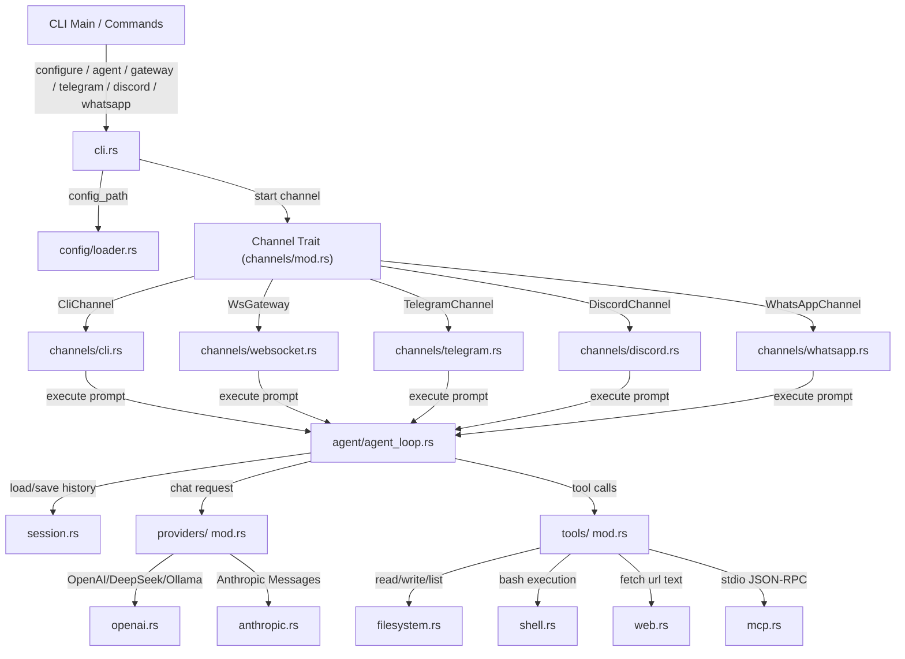

# OpenZ Architecture 🦀⚡

This document describes the design, execution flow, and module architecture of the Rust rewrite of `openz`.

---

## 1. Architectural Overview

`openz` is a modular, high-performance, asynchronous AI agent and gateway designed in Rust. It utilizes the `tokio` runtime for executing non-blocking I/O, subprocess spawns, and networking concurrently.

---

## 2. Core Modules

* **`config/`**: Handles loading, updating, and writing configurations to `~/.openz/config.json`.
* **`providers/`**: Implementations for LLM APIs (OpenAI-compatible and Anthropic).
* **`tools/`**: Registry and implementations for native tools, subagent delegation, and MCP stdio wrapper tools.
* **`cron/`**: Handles scheduling and execution of background cron tasks.
* **`session.rs`**: Stores conversation message logs, dynamic summaries, and long-term memory prompts in JSON files under `~/.openz/sessions/`.
* **`agent/agent_loop.rs`**: The core execution state machine (`TurnState`) that manages conversation restoration, context compaction (LLM summarization and long-term memory updates), command extraction, context loading, LLM completions, tool call routing, session saving, and message responses. Spawns an asynchronous background self-improvement curator task that refines memory and curates procedural skills.
* **`agent/skills.rs`**: Manages loading, saving, deleting, and clearing procedural skills and style guidelines stored under `~/.openz/skills/` that are dynamically injected into the agent system prompt.
* **`agent/activity.rs`**: Tracks global execution states (active session ID, status, and currently running tool) to `~/.openz/activity.json`, providing other communication channels with real-time awareness of what the agent is doing on the machine.
* **`channels/`**: Pluggable communication adapters conforming to a unified `Channel` trait. Standardizes message handling and execution. Currently supports Terminal CLI, WebSocket Gateway, Telegram Polling, and stubs for Discord and WhatsApp. Allows auto-starting gateways on system boot (via systemd user service) or terminal TUI client startup.
