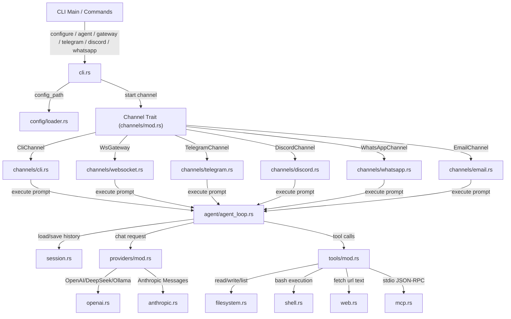

# OpenZ Architecture 🦊

This document describes the design, execution flow, and module architecture of the Rust rewrite of `openz`.

---

## 1. Architectural Overview

`openz` is a modular, high-performance, asynchronous AI agent and gateway designed in Rust. It utilizes the `tokio` runtime for executing non-blocking I/O, subprocess spawns, and networking concurrently.

---

## 2. Core Modules

* **`config/`**: Handles loading, updating, and writing configurations to `~/.openz/config.json`.
* **`providers/`**: Implementations for LLM APIs (OpenAI-compatible and Anthropic Messages).
* **`tools/`**: Registry and implementations for native tools, subagent delegation, and MCP stdio wrapper tools.
* **`cron/`**: Handles scheduling and execution of background cron tasks.
* **`session.rs`**: Stores conversation message logs and dynamic summaries in JSON files under `~/.openz/sessions/`. Implements **SHA-256 Merkle Hash-Chains** linking every interaction, verifying history integrity on load.
* **`agent/agent_loop.rs`**: The core execution state machine (`TurnState`) that manages conversation restoration, context compaction (LLM summarization and long-term memory updates), command extraction, context loading, LLM completions, tool call routing, session saving, and message responses. Spawns an asynchronous background self-improvement curator task that refines memory and curates procedural skills.
* **`agent/skills.rs`**: Manages long-term procedural skills and facts stored inside a structured **SQLite database (`~/.openz/memory.db`)**, migrating legacy flat markdown files automatically on startup.
* **`agent/activity.rs`**: Tracks global execution states (active session ID, status, and currently running tool) to `~/.openz/activity.json`, providing other communication channels with real-time awareness of what the agent is doing on the machine.
* **`channels/`**: Pluggable communication adapters conforming to a unified `Channel` trait. Standardizes message handling and execution. Currently supports Terminal CLI, WebSocket Gateway (with local OpenAI completions endpoint), Telegram Polling, Discord Gateway, WhatsApp Webhooks, and a **pure-Rust Email IMAP/SMTP channel** (`src/channels/email.rs`).
* **`sop/`**: Resilient multi-step Directed Acyclic Graph (DAG) templates executing step tasks in parallel via Tokio. Performs dependency cycle checks, persists state to disk, and dynamically scopes context namespaces for context isolation.
* **`subagents/`**: Built-in specialized subagent profiles. See [docs/subagents.md](file:///home/aswin/programming/vscode/myProjects/ai_agent_tools/openz/docs/subagents.md) for detailed subagent architecture, workspace optimizations, and fallback model resolution.

---

## 3. High-Performance Features

### Hierarchical Context Scoping (DOX-inspired)
OpenZ utilizes the `scope_context` tool powered by the `headroom` MCP server. When executing actions or edits in a given directory, the agent walks up the folder tree, reads any local `AGENTS.md` instruction files, and compiles them into a unified contextual instruction set. This avoids prompt drift and enforces directory-specific constraints.

### Zenflow Checkpointed Transactions
Before performing files edits or system operations, the agent utilizes a transactional flow:
1. Takes a fast snapshot/checkpoint of the workspace directory.
2. Performs edits and runs compiling/testing loops (`cargo check`, `cargo test`).
3. If errors arise, it attempts to self-heal by feeding errors back to the editing loop.
4. If healing fails, it performs a clean rollback to the snapshot to prevent code corruption.

### Semantic Repo Indexing & Vector Search
To find code dependencies instantly, OpenZ indexes structural codebase elements (structs, functions) using `ast_grep` and embeds them into a fast-vector store, allowing semantic lookup of relevant dependencies and code relationships.
