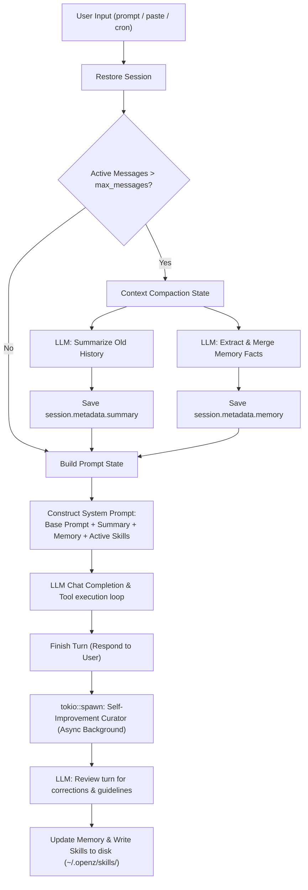

# OpenZ Self-Improvement: Memory & Skills 🧠🦀

OpenZ implements a closed-loop self-improvement learning system modeled after the background review curation pattern of `hermes-agent`. It operates across two tiers to ensure the agent continuously refines its understanding of the user/project and upgrades its task execution capabilities over time.

---

## 1. Dynamic Architecture Overview



---

## 2. Memory vs. Skills

OpenZ distinguishes between factual awareness and procedural capability:

| Tier | Component | Location | Purpose | Format |
| :--- | :--- | :--- | :--- | :--- |
| **Tier 1** | **Memory** | `session.metadata["memory"]` | Captures "who the user is" (desires, preferences, persona) and specific project setup/context details (compiler versions, database selection, entry points). | Markdown list inside session JSON. |
| **Tier 2** | **Skills** | `~/.openz/skills/<skill_name>.md` | Captures "how to perform a class of task" (coding styles, command conventions, workarounds, API usage rules, troubleshooting recipes). | Individual Markdown files in a global directory. |

---

## 3. Dynamic Prompt Injection

When building the system prompt for a new turn, OpenZ automatically loads both memory and skills:

1. **Memory:** Read from session metadata and injected as:
   ```text
   Here is the long-term memory of key facts, preferences, and decisions from this session:
   <memory_markdown>
   ```
2. **Skills:** Scans `~/.openz/skills/` for all `.md` files and appends them to the system prompt:
   ```text
   Here are the active guidelines and procedural skills you should follow:
   === Skill: <name> ===
   <skill_markdown_content>
   ```

---

## 4. Closed-Loop Background Curator (Self-Improvement)

After every assistant response (excluding slash commands), OpenZ spawns a background thread using `tokio::spawn`. This curator reviews the recent turn asynchronously to extract lessons:

1. **System Prompt for Review:** The review LLM call is configured with a specialized prompt requesting a raw JSON containing:
   - `memory_updated`: Boolean indicating if memory has been modified.
   - `memory_content`: The updated markdown list of facts.
   - `skills_to_save`: A list of objects containing `name` and `content` for new or updated skills.
2. **JSON Extraction:** The background curator processes the LLM output, handles markdown code block stripping, and deserializes the response.
3. **Saving to Disk:**
   - **Memory:** Reloads the latest session from disk to prevent message race conditions, updates the metadata memory block, and writes it back.
   - **Skills:** Writes or updates individual markdown skill files under `~/.openz/skills/`.

---

## 5. Slash Commands

Users have direct control over the self-improvement databases through the CLI:

### Memory Management:
* `/memory` - Print the current markdown memory sheet.
* `/memory add <fact>` - Manually register a preference or project detail.
* `/memory clear` - Delete memory for the current session.

### Skills Management:
* `/skills` - List all active skills loaded in `~/.openz/skills/`.
* `/skills clear` - Delete all active skills.
* `/skill view <name>` - View the detailed guidelines inside a specific skill.
* `/skill add <name> <content>` - Manually register or edit a custom skill.
* `/skill delete <name>` - Delete a specific skill.

---

## 6. Dynamic Skill Installation & Setup

OpenZ is capable of dynamically expanding its toolset by researching, installing, and configuring external GitHub repositories or projects directly on the host machine.

### Mechanics:
1. **Trigger:** The user provides a repository URL (e.g., `https://github.com/username/project`) and requests its installation.
2. **Research & Extraction:** The agent uses `web_fetch` to read the repository's README, build instructions, and dependencies.
3. **Execution:** The agent runs shell commands via `exec_command` to clone the code, install dependencies (using package managers like `npm`, `pip`, or `cargo`), and compile the project.
4. **Integration:** Once verified, the agent writes a custom wrapper script and saves a matching Markdown skill file to `~/.openz/skills/` (e.g., `~/.openz/skills/my_new_tool.md`) containing usage instructions and absolute paths.
5. **System Prompt Injection:** In subsequent turns, the new skill is automatically loaded into the system prompt, enabling OpenZ to invoke the newly installed tool dynamically.

---

## 7. Self-Improvement & Maintenance Subagents

To delegate manual or complex self-improvement and system health tasks, OpenZ includes three specialized, protected default subagents:

### 1. `self_improvement`
* **Purpose:** Analyzes queries, feedback, style complaints, and task transcripts to refine memory facts and curate new procedural skills under `~/.openz/skills/`.
* **Delegation Command:**
  ```bash
  /delegate self_improvement Review the recent conversation and extract a coding style guideline for Rust
  ```

### 2. `skill_improvement`
* **Purpose:** Audits, optimizes, and refines existing skills in `~/.openz/skills/`. It reads active skill files, incorporates new workflows, fixes outdated build parameters, and merges overlapping skills.
* **Delegation Command:**
  ```bash
  /delegate skill_improvement Audit the existing python_style skill and update it with the new venv rules we established
  ```

### 3. `openz_maintainer`
* **Purpose:** Diagnoses internal errors, performance issues, configuration discrepancies, or loop detections inside OpenZ itself. It inspects log files, resolves codebase bugs, and ensures system health.
* **Delegation Command:**
  ```bash
  /delegate openz_maintainer We encountered a connection timeout error in our Axum WebSocket channel. Please locate the cause and fix it in the src/ folder.
  ```

---

## 8. Subagent Execution & Enhancements

To make subagents more reliable, flexible, and fully aligned with the parent orchestrator, the following enhancements have been integrated:

* **Dynamic Tool Inheritance**: Subagents dynamically inherit all standard and active MCP tools from the parent orchestrator. This allows subagents (like `researcher` or `reviewer`) to perform code search (`grep_search`, `ast_grep`), web search (`web_search`), and execute commands or builds/tests (`cargo_manager`).
* **Orchestrator Model Defaults**: Newly created subagents automatically default their primary model to the user's active primary orchestrator model (`config.agents.defaults.model`).
* **Last-Resort Model Fallback**: If a subagent's execution profile fails on all of its configured models and fallbacks, the active orchestrator model is appended as the absolute last fallback model before an execution error is returned.
* **TUI Raw-Mode Alignment**: Console logging inside subagents, progress spinners, and security prompts uses a raw-mode safe logger (`tui_println!`) to ensure output alignment is not disrupted (i.e. preventing diagonal alignment) while listening for ESC or input.


