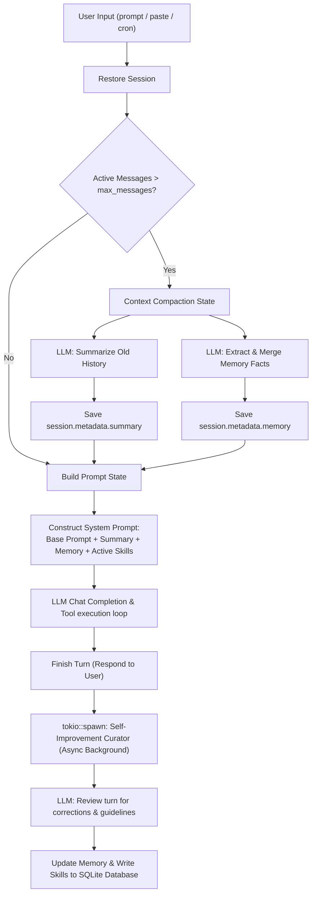

# OpenZ Self-Improvement: Memory & Skills 🧠🦀

OpenZ implements a closed-loop self-improvement learning system modeled after the background review curation pattern of `hermes-agent`. It operates across multiple tiers to ensure the agent continuously refines its understanding of the user/project and upgrades its task execution capabilities over time.

---

## 1. Dynamic Architecture Overview



---

## 2. Memory vs. Skills

OpenZ distinguishes between factual awareness and procedural capability:

| Tier | Component | Location | Purpose | Format |
| :--- | :--- | :--- | :--- | :--- |
| **Tier 1** | **Memory** | `session.metadata["memory"]` | Captures "who the user is" (desires, preferences, persona) and specific project setup/context details (compiler versions, database selection, entry points). | Markdown list inside session JSON. |
| **Tier 2** | **Skills** | SQLite Database (`~/.openz/memory.db`) & local `skills/` | Captures "how to perform a class of task" (coding styles, command conventions, workarounds, API usage rules, troubleshooting recipes). For subagents, skills are isolated by profile (e.g. `profile = 'planner'`). | Structured SQLite rows with workspace file overrides. |

---

## 3. Dynamic Prompt Injection

When building the system prompt for a new turn, OpenZ automatically loads both memory and skills:

1. **Memory:** Read from session metadata and injected as:
   ```text
   Here is the long-term memory of key facts, preferences, and decisions from this session:
   <memory_markdown>
   ```
2. **Skills:** Scans the SQLite database and local `skills/` folder for relevant skill blocks:
   * **Global Agent:** Dynamically matches active skill names matching keywords in the user query.
   * **Specialized Subagents:** In addition to keyword-matched global skills, a subagent unconditionally loads all profile-specific skills defined for its profile name (e.g., `planner` always receives the `milestone_decomposition` skill).
   ```text
   Here are the active guidelines and procedural skills you should follow:
   === Skill: <name> ===
   <skill_markdown_content>
   ```

---

## 4. Hierarchical Context Scoping (DOX-inspired)

In addition to skills, OpenZ integrates hierarchical context scoping:
* Before files are modified, the agent invokes `scope_context` via the `headroom` MCP server.
* The tool walks up the directory tree to search for local `AGENTS.md` instruction files.
* Local guidelines are compiled on the fly and injected into the prompt context, preventing rules violations and ensuring exact local-first alignment.

---

## 5. Closed-Loop Background Curator (Self-Improvement)

After every assistant response (excluding slash commands), OpenZ spawns a background thread using `tokio::spawn`. This curator reviews the recent turn asynchronously to extract lessons:

1. **Throttling Mechanisms:**
   - **Curator Runs:** OpenZ avoids wasteful LLM calls on simple turns (e.g. "what is 2+2"). It skips running the background curator if the conversation context length is small (<4000 tokens) AND no file editing, compiler checks, command execution, or network/browser tools were used. If skipped, it logs `"status": "skipped: throttled (simple turn)"` in `curator_status.json`.
   - **Stale Skills Archival:** Stale skill archival checks (`archive_stale_skills()`) are throttled to run at most once every 24 hours. The check timestamp is persisted in `~/.openz/last_stale_skills_check.json`.
2. **System Prompt for Review:** The review LLM call is configured with a specialized prompt requesting a raw JSON containing:
   - `memory_updated`: Boolean indicating if memory has been modified.
   - `memory_content`: The updated markdown list of facts.
   - `skills_to_save`: A list of objects containing `name` and `content` for new or updated skills.
3. **JSON Extraction:** The background curator processes the LLM output, handles markdown code block stripping, and deserializes the response.
4. **Saving & Profile Isolation:** Writes or updates individual skill definitions under the SQLite database. If the session key indicates it belongs to a subagent (e.g., `subagent:planner:...`), skills are saved with the corresponding profile name (`profile = 'planner'`) to keep subagent expertise cleanly separated from global skills.
5. **Dedicated Status Logging:** On every execution, the curator publishes a JSON run log to `~/.openz/curator_status.json` containing:
   - `last_run_timestamp`: ISO 8601 timestamp.
   - `status`: `"running"`, `"success"`, `"failed"`, or `"skipped: throttled (simple turn)"`.
   - `session_key`: The active session identifier.
   - `memory_updated`: Boolean flag.
   - `skills_saved`: Array of successfully created or refined skill names.
   - `error_message`: Optional error details if compilation/querying failed.

---

## 6. Slash Commands

Users have direct control over the self-improvement databases through the CLI:

### Memory Management:
* `/memory` - Print the current markdown memory sheet.
* `/memory add <fact>` - Register a preference or project detail.
* `/memory clear` - Delete memory for the current session.

### Skills Management:
* `/skills` - List all active skills. Scoped to the active subagent profile if run inside a subagent session.
* `/skills clear` - Delete all active skills.
* `/skill view <name>` - View the detailed guidelines inside a specific skill. Scoped to the active subagent profile if run inside a subagent session.
* `/skill add <name> <content>` - Manually register or edit a custom skill (scoped to the active subagent profile).
* `/skill delete <name>` - Delete a specific skill (scoped to the active subagent profile).

---

## 7. Self-Improvement & Maintenance Subagents

To delegate manual or complex self-improvement and system health tasks, OpenZ includes specialized, protected default subagents:

### 1. `self_improvement`
* **Purpose:** Analyzes queries, feedback, style complaints, and task transcripts to refine memory facts and curate new procedural skills.

### 2. `skill_improvement`
* **Purpose:** Audits, optimizes, and refines existing skills. It reads active skill files, incorporates new workflows, fixes outdated build parameters, and merges overlapping skills.

### 3. `openz_maintainer`
* **Purpose:** Diagnoses internal errors, performance issues, configuration discrepancies, or loop detections inside OpenZ itself.

### 4. `mermaid_designer`
* **Purpose:** Specializes in visual flowchart mapping and system architecture diagrams, translating structures to neat SVGs.

### 5. `video_editor`
* **Purpose:** Programmatically composes and compiles neat timelines into MP4 videos using vector paths or text overlays.

---

## 8. Cloud-First Remote Embeddings

OpenZ supports swapping out local ONNX-based vector embeddings (`all-MiniLM-L6-v2`) for cloud provider embedding API endpoints to optimize RAM, CPU, and disk storage overhead.

### Configuration (`~/.openz/config.json`)
```json
{
  "embeddings": {
    "mode": "cloud", 
    "preferred_provider": "google_ai_studio"
  }
}
```

* **Modes:**
  - `"local"` (default): Runs ONNX embedding model locally.
  - `"cloud"`: Attempts cloud embedding API first, falling back to local model if offline or API key is missing.
  - `"cloud_only"`: Bypasses local ONNX embeddings completely. Bypasses downloading and loading ONNX weights to save memory.
* **Preferred Providers:** `"google_ai_studio"`, `"cohere"`, `"openai"`, or `"opencode_zen"`.

---

## 9. Native Compiler Auto-Healing

When coding or compiling tasks encounter build errors, OpenZ provides a unified native reflection tool called `compiler_auto_heal` to automatically repair syntax, borrow checker, and compiler errors in a loop.

### How it works:
1. The tool takes a `file_path`, a coding `instruction`, and a `compile_command` (e.g. `cargo check`).
2. It sends the initial code and edit instructions to the LLM to modify the file content.
3. It writes the updated content back to the target file.
4. It natively executes the `compile_command` in Rust.
5. If compilation fails, the stderr/stdout output is captured and fed back to the LLM as compilation feedback.
6. The loop iterates (up to `max_iterations`, default: 3, max: 5) until the file compiles successfully or the iteration limit is reached.
