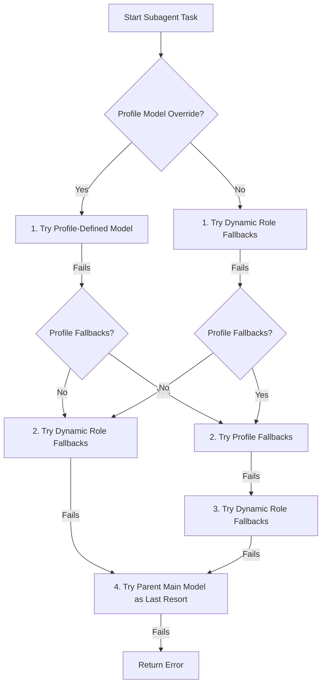

# OpenZ Subagents System 🤖🚀

OpenZ uses a pluggable, specialized subagent delegation framework. Subagents are registered as dynamic tools at the LLM level and executed as parallel child agent loops.

---

## 1. Core Concepts
* **Built-in Profiles**: OpenZ comes pre-configured with 15+ specialized subagent profiles (like `planner`, `researcher`, `debugger`, `reviewer`, `devops_agent`, `vision_agent`) defined in [src/subagents/mod.rs](file:///home/aswin/programming/vscode/myProjects/ai_agent_tools/openz/src/subagents/mod.rs).
* **Tool Representation**: The `ToolRegistry` dynamically formats subagent profiles as tools. When the LLM calls a subagent tool (e.g., `vision_agent(goal: "...")`), a `DelegateProfileTool` instance executes a child `AgentLoop`.

---

## 2. Workspace Isolation & Startup Optimization
To balance safety and performance, subagent workspace sandboxing is dynamically scoped based on execution safety profiles. 

Spawning an isolated workspace requires running `git worktree add` and scanning for changes, which adds several seconds of start-up latency. To eliminate this overhead, subagents are split into two execution modes:

### Isolated Workspace Mode (`needs_workspace = true`)
Subagents that compile, test, or modify files in the repository run in a clean, isolated Git worktree workspace. This protects the active developer workspace from corruptive edits or transient test outputs.
* **Applies to**: `orchestrator`, `architect`, `git_ops_agent`, `dependency_manager`, `frontend_architect`, `media_designer`, `sop_designer`, `api_integrator`, `performance_tuner`, `document_compiler`, `presentation_designer`, `code_synthesizer`, `automation_agent`, `coding_agent`, `debugger`, `test_engineer`, `devops_agent`, `refactor_agent`, `openz_maintainer`, `mcps_manager`.

### Shared/In-Place Workspace Mode (`needs_workspace = false`)
Read-only, analytical, research, or configuration-focused subagents run in-place in the active workspace directory. Skipping workspace setup allows these subagents to start up **instantly**.
* **Applies to**: `vision_agent`, `researcher`, `planner`, `reviewer`, `code_auditor`, `summarizer_agent`, `self_improvement`, `skill_improvement`, `docs_lookup_agent`, `ast_searcher`, `browser_operator`, `communication_manager`.

---

## 3. Multi-Tier Model Cascading System
To maximize task execution success and ensure high availability, subagents try a prioritized list of model targets:

1. **Primary Model**: The model configured explicitly in the subagent's profile (under `model: Some(...)`), or the primary dynamic fallback model suited for that role.
2. **Fallback Models**: Any models listed explicitly in the profile's `fallbacks` field.
3. **Dynamic Role Fallbacks**: If no profile overrides are specified, it tries the system-available models configured on the host machine in priority order (e.g., Gemini 2.5 Flash, Claude 3.5 Sonnet, GPT-4o-mini).
4. **Main Agent Model (Last Resort)**: The parent agent's active model (`config.agents.defaults.model`) is placed at the absolute end of the try list. It is tried **only** if all specialized subagent targets and fallbacks have failed.
