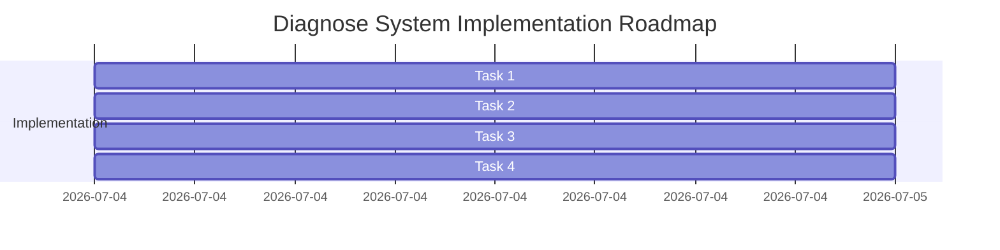

# Plan — Porting and Implementing System Health Diagnostics (`diagnose_system` tool)

This plan details how to build and register the native `diagnose_system` tool in OpenZ.

---

## 📅 Roadmap Overview

---

## 📦 Detailed Tasks

### Task 1: Create `diagnose_system` Tool in `src/tools/self_management.rs`
Implement the `diagnose_system` tool inside [src/tools/self_management.rs](file:///home/aswin/programming/vscode/myProjects/ai_agent_tools/openz/src/tools/self_management.rs):
- **Parameters**:
  - `check_latency` (Boolean, optional, default: `true`): Ping active LLM providers.
  - `check_db_integrity` (Boolean, optional, default: `false`): Run `PRAGMA integrity_check` on all SQLite files.
- **Behavior**:
  1. **Compute OpenZ Directories Space**: Recursively scan and calculate total bytes and file counts in:
     * `~/.openz/sessions/`
     * `~/.openz/tool_outputs/`
     * `~/.openz/traces/`
     * `~/.openz/skills/`
  2. **SQLite Database Inspections**: Check file existence, size, and connectability for:
     * `~/.openz/memory.db`
     * `~/.openz/docs.db`
     * `~/.openz/graph_memory.db`
     * `~/.openz/ccr_cache.db`
     * `~/.openz/thoughts.db`
     * If `check_db_integrity` is `true`, execute `PRAGMA integrity_check;` on each and record the result.
  3. **LLM Provider Latency**: If `check_latency` is `true`, read `config.json` active providers. For each provider with a configured API key/endpoint (e.g. OpenAI, Anthropic, OpenRouter), send an async request to its base URL to measure round-trip ping latency.

### Task 2: Register Tool in `src/cli/builder.rs`
Register `DiagnoseSystemTool` in `src/cli/builder.rs`.

### Task 3: Implement Unit Tests
Write test `test_diagnose_system` inside `self_management.rs` asserting correct metadata reporting and mock database connection checks.

### Task 4: Document the Tool
Update `onpkg_docs/tools.md` to document the new `diagnose_system` tool.
