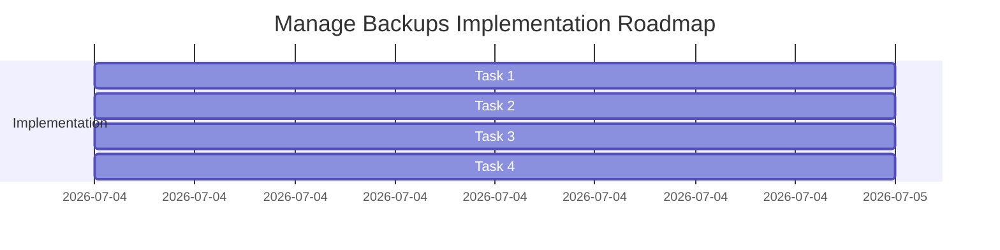

# Plan — Implementing Configuration & Skills Snapshot Management (`manage_backups` tool)

This plan details how to build and register the native `manage_backups` tool in OpenZ.

---

## 📅 Roadmap Overview

---

## 📦 Detailed Tasks

### Task 1: Create `ManageBackupsTool` in `src/tools/self_management.rs`
Implement the `manage_backups` tool inside [src/tools/self_management.rs](file:///home/aswin/programming/vscode/myProjects/ai_agent_tools/openz/src/tools/self_management.rs):
- **`create` Action**:
  - Read `config.json` if it exists.
  - Read `subagents.json` if it exists.
  - Scan `~/.openz/skills/` directory and collect filenames + contents of all `.md` files.
  - Bundle these into a single JSON struct:
    `{ "version": "1.0", "timestamp": "...", "config": ..., "subagents": ..., "skills": { "name.md": "content" } }`
  - Write it to `~/.openz/backups/backup_<timestamp>.json`.
- **`list` Action**:
  - Scan `~/.openz/backups/` for files ending with `.json`.
  - Return their names, disk sizes, and creation timestamps.
- **`restore` Action**:
  - Read the specified backup file from `~/.openz/backups/`.
  - Overwrite `config.json`.
  - Overwrite `subagents.json`.
  - Clean up existing skills inside `~/.openz/skills/` and write back the skills from the backup JSON.
- **`delete` Action**:
  - Delete the selected backup JSON file from `~/.openz/backups/`.

### Task 2: Register Tool in `src/cli/builder.rs`
Register `ManageBackupsTool` in `src/cli/builder.rs`.

### Task 3: Implement Unit Tests
Write test `test_manage_backups` inside `self_management.rs` asserting correct snapshot creation, listing, deletion, and restoration states.

### Task 4: Document the Tool
Update `onpkg_docs/tools.md` to document the new `manage_backups` tool.
