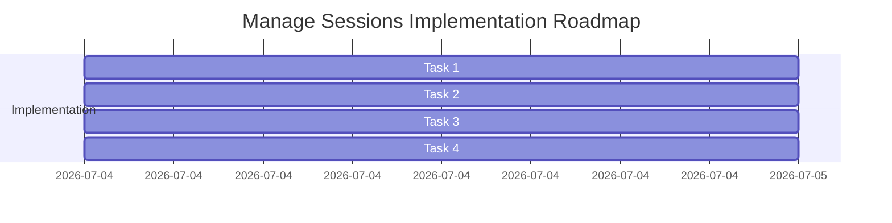

# Plan — Implementing Session Management & Storage Curation (`manage_sessions` tool)

This plan details how to build and register the native `manage_sessions` tool in OpenZ.

---

## 📅 Roadmap Overview

---

## 📦 Detailed Tasks

### Task 1: Create `ManageSessionsTool` in `src/tools/self_management.rs`
Implement the `manage_sessions` tool inside [src/tools/self_management.rs](file:///home/aswin/programming/vscode/myProjects/ai_agent_tools/openz/src/tools/self_management.rs):
- **`list` Action**:
  - Scan `~/.openz/sessions/` directory.
  - Parse each session file as JSON, extract the number of elements in `.messages`, and query the file's size and last modified metadata.
- **`prune` Action**:
  - Scan `~/.openz/tool_outputs/` directory.
  - Filter files matching `output_*_*.json`.
  - Delete files where `last_modified` is older than `older_than_days` (default 7).
- **`archive` Action**:
  - Read `session_key` session file.
  - Ensure `~/.openz/archives/` directory exists.
  - Write it to `~/.openz/archives/session_key_<timestamp>.json` and delete the active session file + lock file.
- **`delete` Action**:
  - Permanently delete `~/.openz/sessions/<session_key>.json` and `~/.openz/sessions/<session_key>.lock`.

### Task 2: Register Tool in `src/cli/builder.rs`
Register `ManageSessionsTool` in `src/cli/builder.rs`.

### Task 3: Implement Unit Tests
Write test `test_manage_sessions` inside `self_management.rs` asserting correct listing, archiving, deleting, and output pruning behavior.

### Task 4: Document the Tool
Update `onpkg_docs/tools.md` to document the new `manage_sessions` tool.
