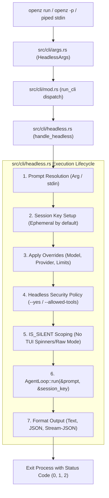

# OpenZ Headless Mode CLI Design Spec 🦊⚡

**Status:** Validated & Approved  
**Date:** 2026-09-17  
**Target Release:** OpenZ v0.0.189  
**Author:** Pair Programming Agent & User  

---

## 1. Motivation & Background

OpenZ is an ultra-fast, async personal AI agent framework and multi-channel gateway written in Rust. Until now, invoking the agent directly from the command line required entering an interactive terminal UI (the default Ratatui TUI channel) or sending messages over WebSocket/Telegram/Discord/WhatsApp channels.

However, as AI agents become components in larger multi-agent systems, external orchestrators, CI/CD pipelines, and automated test harnesses, OpenZ requires a **headless, non-interactive execution mode**. 

This feature allows:
1. **External AI Agents & Orchestrators** (Claude Code, Antigravity, Cursor, Python/Bash scripts, etc.) to invoke OpenZ as an autonomous subagent:
   ```bash
   openz run "Analyze git diff and generate a changelog summary" --output-format json
   ```
2. **Automated Testing & End-to-End Verification**: CI pipelines and developers can easily test whether OpenZ works end-to-end (connecting to LLM providers, executing native tools, respecting security boundaries, producing structured output) without needing pseudo-terminal keyboard automation or TUI interaction.
3. **Piped Input & Shell Workflows**: Developers and shell pipelines can feed input directly via standard input:
   ```bash
   git diff | openz run "Review this diff for security bugs"
   ```
4. **Isolated Ephemeral Execution**: Automated runs do not pollute the user's primary interactive CLI session history by default.

---

## 2. Inspirations & Industry Standards

- **Claude Code CLI (`claude -p` / `--print`)**: Fast, non-interactive task execution with `--output-format json` and `--allowed-tools`.
- **Aider (`aider --message` / `-m` / `--yes-always`)**: Non-interactive command passing with automatic confirmation overrides for continuous scripting.
- **UNIX Pipeline Philosophy**: Standard input (`stdin`) processing, structured clean output on `stdout`, diagnostics on `stderr`, and deterministic exit codes (`0` for success, non-zero for failures).

---

## 3. Architecture & Data Flow



---

## 4. Detailed Component Design

### 4.1. CLI Arguments & Invocation Syntax ([`src/cli/args.rs`](file:///home/aswin/programming/vscode/myProjects/ai_agent_tools/openz/src/cli/args.rs))

Dual invocation support:
1. **Top-level prompt flag** for fast one-liners:
   ```bash
   openz -p "Inspect the open ports on localhost"
   ```
2. **Dedicated subcommand** (`run` aliased to `exec`):
   ```bash
   openz run "Inspect the open ports on localhost" --output-format json -y
   ```

#### `HeadlessArgs` Definition
```rust
#[derive(clap::Parser, Debug, Clone, Default)]
pub struct HeadlessArgs {
    /// The prompt/task instruction to execute. If "-" or omitted in piped mode, reads from stdin.
    #[arg(index = 1)]
    pub prompt: Option<String>,

    /// Top-level prompt shortcut (-p, --prompt)
    #[arg(short = 'p', long = "prompt")]
    pub prompt_flag: Option<String>,

    /// Output format: "text" (default), "json", or "stream-json"
    #[arg(long, default_value = "text")]
    pub output_format: String,

    /// Automatically approve all tool actions without interactive prompts
    #[arg(short = 'y', long = "yes")]
    pub yes: bool,

    /// Comma-separated list of pre-approved tool names (e.g. "read_file,grep_search")
    #[arg(long)]
    pub allowed_tools: Option<String>,

    /// Explicit session key (defaults to ephemeral "cli:headless_<timestamp>_<uuid>")
    #[arg(long)]
    pub session: Option<String>,

    /// Resume the most recent headless/CLI session thread
    #[arg(long)]
    pub r#continue: bool,

    /// Model override (e.g. "anthropic/claude-3-5-sonnet", "openai/gpt-4o")
    #[arg(short = 'm', long = "model")]
    pub model: Option<String>,

    /// Provider override (e.g. "anthropic", "openai", "groq")
    #[arg(long)]
    pub provider: Option<String>,

    /// Maximum tool execution loop iterations (defaults to config: 200)
    #[arg(long)]
    pub max_iterations: Option<usize>,

    /// Timeout in seconds for the entire turn (defaults to config: 300)
    #[arg(long)]
    pub timeout: Option<u64>,
}
```

In `CliArgs`:
```rust
#[derive(Parser)]
#[command(name = "openz", version = env!("CARGO_PKG_VERSION"), about = "OpenZ - Rebranded Ultra-Lightweight Personal AI Agent")]
pub struct CliArgs {
    /// Fast top-level headless prompt flag
    #[arg(short = 'p', long = "prompt", global = true)]
    pub prompt: Option<String>,

    /// Output format for top-level headless execution
    #[arg(long, global = true)]
    pub output_format: Option<String>,

    /// Auto-approve tool execution for top-level headless execution
    #[arg(short = 'y', long = "yes", global = true)]
    pub yes: bool,

    #[command(subcommand)]
    pub command: Option<Command>,
}
```

In `Command`:
```rust
pub enum Command {
    // ...
    #[command(alias = "exec")]
    Run(HeadlessArgs),
}
```

---

### 4.2. Headless Runner Core ([`src/cli/headless.rs`](file:///home/aswin/programming/vscode/myProjects/ai_agent_tools/openz/src/cli/headless.rs))

`headless.rs` implements the end-to-end execution flow:

1. **Prompt Resolution**:
   - Merges positional `prompt` and `-p / --prompt` flags.
   - If prompt is `"-"` or omitted while `std::io::stdin()` is a pipe (not a terminal TTY), reads UTF-8 content to EOF asynchronously via `tokio::io::AsyncReadExt::read_to_string`.
   - If prompt is still empty, returns an error message with usage syntax and exits with code `1`.

2. **Session Key Setup**:
   - If `--session <key>` is provided, uses `<key>` directly.
   - Else if `--continue` is specified, loads the most recently updated session summary from `SessionManager`.
   - Otherwise, generates an isolated ephemeral session key:
     `format!("cli:headless_{}_{}", chrono::Utc::now().format("%Y%m%d_%H%M%S"), uuid::Uuid::new_v4().simple())`
   - Ephemeral sessions prevent test queries and autonomous subagent calls from clobbering the human developer's interactive session history.

3. **Configuration & Loop Construction**:
   - Loads base configuration via `crate::config::loader::load_config()?`.
   - Applies CLI overrides (`--model`, `--provider`, `--max_iterations`, `--timeout`).
   - Builds the `AgentLoop` via `crate::cli::builder::build_agent_loop(config.clone()).await?`.

4. **Security Policy & Non-Interactive Safety**:
   - In headless mode, interactive prompts are impossible.
   - Low-risk/read-only tools (`read_file`, `grep_search`, `code_outline`, `system_info`, etc.) execute normally.
   - Mutating/high-risk tools (`exec_command`, `write_file`, `patch_file`, `db_write`, etc.):
     - Allowed if `--yes` / `-y` is enabled.
     - Allowed if tool name is explicitly included in `--allowed-tools`.
     - Otherwise, immediately denied without blocking or hanging, returning:
       `{"error": "Execution denied: Tool '<name>' requires confirmation in headless mode. Run with -y/--yes or --allowed-tools to permit."}`
   - If a required tool was rejected due to lack of confirmation, the run sets exit code `2`.

5. **Silent Scoping & Execution**:
   - Wraps the call in `crate::agent::style::spinner::IS_SILENT.scope(true, ...)` to ensure no crossterm raw mode, cursor codes, or terminal spinners corrupt stdout.
   - Invokes `agent_loop.run(&prompt, &session_key).await`.

---

### 4.3. Structured Output Contracts

The output format is selected with `--output-format <text|json|stream-json>`.

#### 1. Plain Text Mode (`text`, default)
Outputs pure markdown/text content to `stdout`:
```text
All 28 test modules passed with 0 clippy warnings.
```

#### 2. Structured JSON Mode (`json`)
Outputs a typed JSON object on `stdout`:
```json
{
  "status": "success",
  "content": "All 28 test modules passed with 0 clippy warnings.",
  "session_id": "cli:headless_20260917_013000_1234abcd",
  "tools_used": ["cargo_manager", "git_manager"],
  "tool_iterations": 2,
  "duration_ms": 1420,
  "model": "anthropic/claude-3-5-sonnet",
  "provider": "anthropic",
  "error": null,
  "exit_code": 0
}
```

In the event of an error:
```json
{
  "status": "security_denied",
  "content": "",
  "session_id": "cli:headless_20260917_013000_1234abcd",
  "tools_used": [],
  "tool_iterations": 1,
  "duration_ms": 110,
  "model": "anthropic/claude-3-5-sonnet",
  "provider": "anthropic",
  "error": "Execution denied: Tool 'exec_command' requires confirmation in headless mode. Run with -y/--yes to permit.",
  "exit_code": 2
}
```

#### 3. Streaming JSON Mode (`stream-json`)
Streams NDJSON events in real-time on `stdout`:
```json
{"event": "start", "session_id": "cli:headless_...", "model": "..."}
{"event": "token", "delta": "Analyzing "}
{"event": "token", "delta": "repository..."}
{"event": "tool_start", "tool": "git_manager", "arguments": {"action": "status"}}
{"event": "tool_end", "tool": "git_manager", "duration_ms": 35}
{"event": "finish", "status": "success", "content": "..."}
```

---

### 4.4. Exit Codes

- `0`: Success — turn completed normally.
- `1`: General Error — invalid arguments, timeout, LLM API failure.
- `2`: Security Policy Denied — a mutating tool was denied because `--yes` or `--allowed-tools` was not provided.

---

## 5. Testing & Verification Strategy

### 5.1. Sibling Test Module: [`src/cli/headless_tests.rs`](file:///home/aswin/programming/vscode/myProjects/ai_agent_tools/openz/src/cli/headless_tests.rs)

1. **`test_headless_cli_args_parsing`**:
   - Validates `openz -p "hello" --output-format json -y` parses into `HeadlessArgs`.
   - Validates `openz run "hello" --allowed-tools "read_file,grep_search"` parses correctly.
   - Validates `openz exec "..."` alias maps to `Command::Run`.
2. **`test_headless_output_json_serialization`**:
   - Asserts `HeadlessRunOutput` serializes to valid JSON matching the schema for both success and error cases.
3. **`test_headless_security_policy_enforcement`**:
   - Validates that low-risk read tools execute without confirmation.
   - Validates that high-risk tools are denied when `--yes` is absent and allowed when `--yes` is present.
   - Validates that high-risk tools match `--allowed-tools` lists.
4. **`test_headless_session_key_resolution`**:
   - Validates ephemeral session key generation with random UUIDs.
   - Validates custom session key retention.
5. **`test_headless_execution_with_mock_provider`**:
   - Runs an end-to-end headless turn using `MockProvider` (completely offline, zero API tokens).
   - Validates exit codes and output formatting.

### 5.2. Resource & Build Invariants

- All tests run with job 1:
  ```bash
  cargo test -p openz --lib cli::headless_tests -j 1
  ```
- Type-checking with job 1:
  ```bash
  cargo check -p openz -j 1
  ```
- Tool invariant: Exact 260 native tools invariant verified and preserved.
- Compiler warnings: 0 clippy warnings across the workspace.
- Synchronous SemVer update: Bump version from `0.0.188` to `0.0.189` across `Cargo.toml`, `onpkg.json`, `README.md`, and record release details in `CHANGELOG.md`.

---
