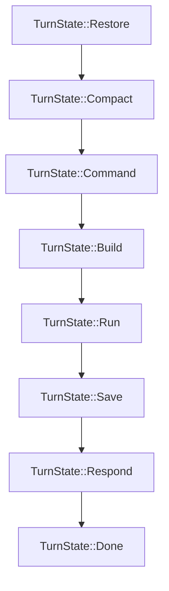

# OpenZ Agent Loop Instruction Guide 🦊🔄

This skill describes the core turn execution loop, the state machine, and session management flow of OpenZ. Use it to understand and modify the agent execution loop and session history compaction.

## 1. The `TurnState` State Machine

The core executor of OpenZ is `AgentLoop` in `src/agent/agent_loop.rs`. Each turn runs through a series of states in a loop until it reaches `TurnState::Done`:

### TurnState Details
- **`Restore`**: Loads the session history from `~/.openz/sessions/<session_key>.json`. Appends the incoming user message to the session message list.
- **`Compact`**: Prevents token bloat. If history length exceeds `config.agents.defaults.max_messages`:
  - Scans backward to locate the nearest `user` message to begin the kept history slice (ensuring no orphaned `tool` or `assistant` messages).
  - Summarizes the truncated history using the LLM.
  - Updates the dynamic summary metadata inside the session.
- **`Command`**: Scans the input for user slash commands (e.g., `/goal`, `/schedule`, `/subagent`) and runs native command routing instead of LLM inference if found.
- **`Build`**: Assembles the LLM system prompt dynamically:
  - Base system instructions.
  - History compaction summaries & consolidated long-term memories.
  - Procedural skills and style guidelines loaded from `~/.openz/skills/*.md`.
  - Global activity context.
- **`Run`**: The main LLM chat loop (up to `max_tool_iterations`, default 200). If the LLM generates a tool call:
  - Iterates and parses tool calls.
  - Intercepts calls via `SecurityGuard::is_sensitive` for approval.
  - Executes tool async under the crossterm spinner.
  - If output exceeds 4000 characters, writes the raw output to `~/.openz/tool_outputs/`, runs context compaction, and injects the compressed/truncated result.
- **`Save`**: Saves the updated `Session` object back to the JSON file.
- **`Respond`**: Forwards the final text response back to the channel.
- **`Done`**: Turn is complete. Spawns the async background self-improvement curator to review the conversation.

---

## 2. Background Self-Improvement Curator

After completing a non-slash-command turn, OpenZ launches an asynchronous tokio task to:
1. Review the conversation flow and extract memory updates.
2. Refine or generate procedural skills under `~/.openz/skills/` based on successful patterns or fixed errors.
3. Reload/save sessions carefully to prevent race conditions from concurrent channel handlers.
