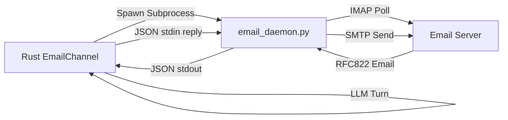

# Email Channel Integration Guide 📧🦊

This skill outlines how to configure, run, and maintain the Email integration channel in OpenZ.

## 1. How It Works

Rather than compiling heavy C-based OpenSSL/TLS libraries natively in Rust (which causes compiler and target platform compatibility issues), OpenZ utilizes a hybrid subprocess daemon pattern:



1. **Rust Integration** ([src/channels/email.rs](file:///home/aswin/programming/vscode/myProjects/ai_agent_tools/openz/src/channels/email.rs)): Spawns the embedded python script `email_daemon.py` on startup, injecting configuration details as environment variables. It reads events from Python's standard output.
2. **Python Daemon** ([src/channels/email_daemon.py](file:///home/aswin/programming/vscode/myProjects/ai_agent_tools/openz/src/channels/email_daemon.py)): Connects to the configured IMAP server, selects the INBOX, and polls for unread (`UNSEEN`) emails. 
3. **Turn Execution**: When an email is received, it is decoded, formatted as JSON, and pushed to Rust. Rust runs the agent loop under the session key `email_<sender_address>`.
4. **SMTP Reply**: The agent response is pushed back to the daemon's stdin as a JSON action, which delivers it using standard Python SMTP library connections.

---

## 2. Configuration Settings

The channel is configured under the `channels.email` section in `~/.openz/config.json`:

```json
{
  "channels": {
    "email": {
      "enabled": true,
      "imap_server": "imap.gmail.com",
      "imap_port": 993,
      "smtp_server": "smtp.gmail.com",
      "smtp_port": 465,
      "username": "agent@gmail.com",
      "password": "your-app-password",
      "poll_interval_secs": 60
    }
  }
}
```
* **Security Note**: Always use app-specific passwords (like Gmail App Passwords) rather than your raw email passwords.
