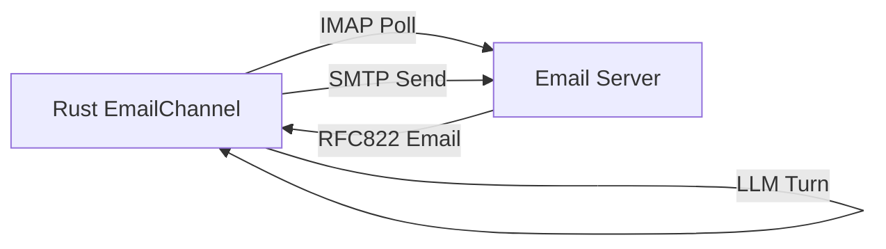

# Email Channel Integration Guide 📧🦊

This skill outlines how to configure, run, and maintain the Email integration channel in OpenZ.

## 1. How It Works

OpenZ uses pure Rust libraries for email handling — `imap` for IMAP polling and `lettre` for SMTP dispatch — with `mailparse` for parsing RFC822 MIME envelopes:



1. **Rust Integration** ([src/channels/email.rs](../src/channels/email.rs)): Uses `imap` crate to connect to the configured IMAP server, select INBOX, and poll for unread (`UNSEEN`) emails.
2. **Message Parsing**: Uses `mailparse` to decode RFC822 MIME envelopes, extracting sender, subject, and text/plain body recursively from nested multipart structures.
3. **Turn Execution**: The email text is fed to `AgentLoop` under the session key `email_<sender_address>`, with full tool execution and response generation.
4. **SMTP Reply**: The agent response is sent back via `lettre`'s async SMTP transport with TLS support.

---

## 2. Configuration Settings

The channel is configured under the `channels.email` section in `~/.openz/config.json`:

```json
{
  "channels": {
    "email": {
      "enabled": true,
      "imap_server": "imap.gmail.com",
      "imap_port": 993,
      "smtp_server": "smtp.gmail.com",
      "smtp_port": 465,
      "username": "agent@gmail.com",
      "password": "your-app-password",
      "poll_interval_secs": 60
    }
  }
}
```
* **Security Note**: Always use app-specific passwords (like Gmail App Passwords) rather than your raw email passwords.
