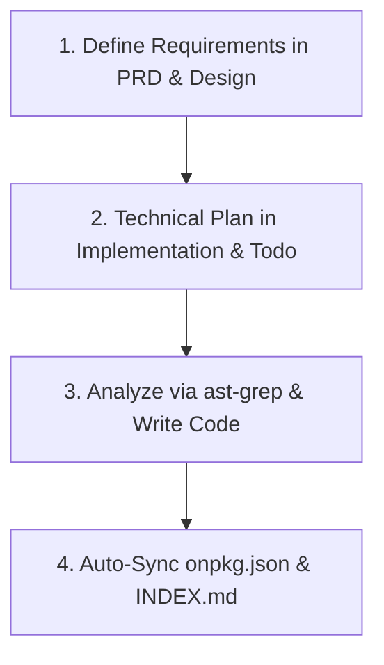

# Spec-Driven Development (SDD) Workflow 📋⚙️

This guide outlines the spec-driven development pipeline used by OpenZ and `onpkg`, heavily inspired by **OpenSpec** (change-proposals and living documentation) and **Crush** (deep workspace/LSP context awareness).

Whenever you build, edit, or modify features in an `onpkg` enabled project, you must follow this lifecycle.

---

## 1. The 5 Core Manifests

OpenZ dynamically manages five core manifests in `onpkg_docs/` to represent the complete project blueprint:

1. **`prd.md` (Product Requirements)**: Defines the *what* and *why*—target features, user personas, in-scope requirements, and out-of-scope bounds.
2. **`content.md` (Copy & Assets)**: Tracks interface text, headings, buttons copy, graphics, and asset paths to keep visual text separated from logic.
3. **`design.md` (UI & Aesthetics)**: Describes visual styles, palettes (e.g. HSL tailored color schemes), layout structures, responsive breakpoints, and micro-animations.
4. **`implementation.md` (Technical Specs)**: Details file architecture, entrypoint signatures, data-flow models, database schemas, and API routes.
5. **`todo.md` (Task Tracking)**: A checkbox list tracking active implementation progress (Todo, In Progress, Done).

---

## 2. Structural Analysis with Tree-sitter & `ast-grep`

OpenZ uses `ast-grep` (which runs a high-performance **Tree-sitter** engine under the hood) to understand codebases structurally.
- When creating or modifying code, do not just search for strings. Use `ast_grep` to locate function signatures, structures, and trait implementations (e.g., searching for `struct $NAME { $$$ }` or `fn $FUNC($$$)`).
- Document your findings in the **Structural Analysis** section of `implementation.md` to ensure your design corresponds to actual code AST signatures.

---

## 3. The Development Lifecycle

Follow these steps for every feature addition or modification:

1. **Define/Refine Specs**: Edit `prd.md` and `design.md` first. Ensure requirements and styles are agreed upon before writing code.
2. **Technical Plan**: Update `implementation.md` and list execution tasks in `todo.md`.
3. **Code & Analyze**: Use `ast_grep` to analyze current patterns. Write modular, clean code. Tick off checklist items in `todo.md`.
4. **Auto-Synchronization**: Upon saving, OpenZ automatically scans the workspace structure to update `onpkg.json` (registering new packages, architecture directories, and active skills) and updates `onpkg_docs/INDEX.md` links.
